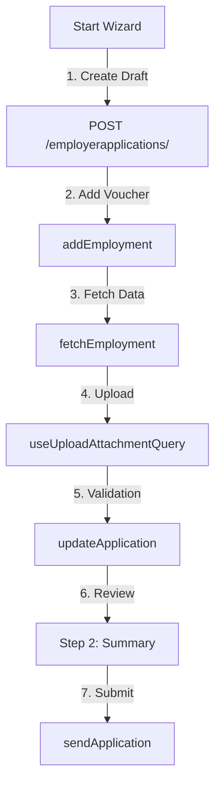

# Kesäseteli Employer UI Design

This document outlines the architecture and user flow for the Kesäseteli Employer application, specifically focusing on the Application Wizard and the data persistence lifecycle.

## 1. Authentication & Organisation Context

### Suomi.fi Authorization
Users must authorize via **Suomi.fi e-Authorizations** to act on behalf of a company.

### Organization Roles & Business ID
- When the user logs in, the application retrieves their **Organization Roles**.
- The **Business ID** (identifier) is extracted from these roles.
- On the backend, `get_or_create_company_using_organization_roles` uses this Business ID to:
    1.  Check if the company already exists in the database.
    2.  If not, fetch official data (name, address, industry) from the **YTJ API**.
    3.  Create or update the local `Company` record.

---

## 2. Application Wizard Flow

The wizard manages the lifecycle of a Summer Voucher application across three main steps.

### Step 1: Application Data
This is the primary data entry view, split into two sections:

#### A. Employer Section
- Displays company details (prefilled from the YTJ data linked during initialization).
- Contains contact person details and invoicing information.

#### B. Employment Section
- **Fetch Logic**: The user provides the youth's **Name** and **Voucher Serial Number**.
- **API Call**: `fetchEmployment` calls the backend, which matches the data against the **Youth Summer Voucher API**.
- **Data Merging**: If matched, the form is partially prefilled (birthdate, school, etc.). Custom logic in `useApplicationApi` ensures manual user edits are preserved during this merge.
- **Attachments**: Users upload required documents (contract, payslip). Each upload is linked to the specific `EmployerSummerVoucher`.
- **Audit Logging**: Every request to fetch youth data is audit-logged on the backend. If a match is found, the log links to the youth's application; if not, an anonymous access attempt is recorded for security monitoring.

### Step 2: Summary & Confirmation
- A read-only preview of all data provided in Step 1.
- Allows the user to verify everything before the final "Submit" action.

### Step 3: Completion (Thank You)
- Displays a success message.
- Provides navigation to return to the **Dashboard** or start a **New Application**.

---

## 3. Lifecycle & Draft Persistence

To prevent data loss, the application maintains a "Draft" status on the backend. All drafts are saved with `status: 'draft'`.

### Draft Lifecycle Diagram

### Technical Draft Triggers
Drafts are created or updated automatically at these points:

1.  **Wizard Initiation**: Triggered by `useCreateApplicationQuery`. This is the first time the application receives a UUID from the server.
2.  **Adding Employment**: Triggered by `addEmployment` in `useApplicationApi`.
3.  **Fetching Youth Data**: Triggered immediately after a successful youth data fetch to persist the prefilled info.
4.  **Attachment Upload**: Triggered by `useUploadAttachmentQuery` every time a file is linked to a voucher.
5.  **Navigation (Next)**: Triggered when the user clicks "Next" in Step 1. The form must be valid for this save to occur.

---

## 4. Technical Stack Highlights
- **Frontend**: React, React Hook Form, React Query.
- **State Management**: Form state is managed locally via `useFormContext` and synced to the backend via `useApplicationApi`.
- **API**: Django Rest Framework (DRF) with custom ViewSets (`EmployerApplicationViewSet`) and Serializers.
- **Persistence**: `ApplicationPersistenceService` synchronizes Step 1 fields to `sessionStorage`. Data is obfuscated (Base64) before storage to prevent PII (like IBANs) from being visible to simple browser scanners.
